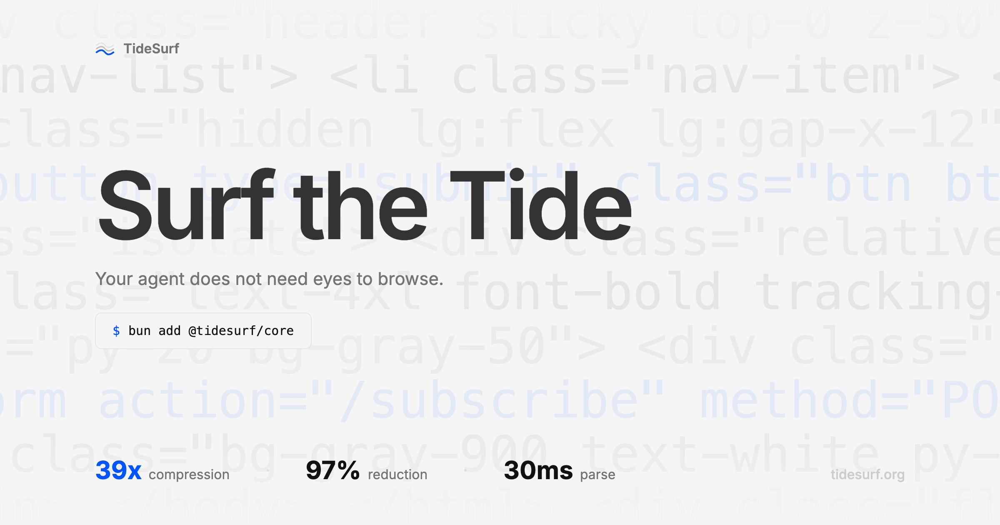

  

<h2 align="center">
    TideSurf
</h2>

    <a href="README.md">English</a> | <a href="README.ja.md">日本語</a> | <strong>한국어</strong>

  <strong><a href="https://tidesurf.org">About</a></strong> |
  <strong><a href="https://tidesurf.org/docs">Documentations</a></strong>

  사실, 웹 탐색에는 옴니모달도 비전 모델도 필요하지 않습니다. 
  TideSurf는 DOM을 전달함으로서 최적의 Agentic 웹 탐색을 가능하게 합니다.

 

  

 

  
  
  

